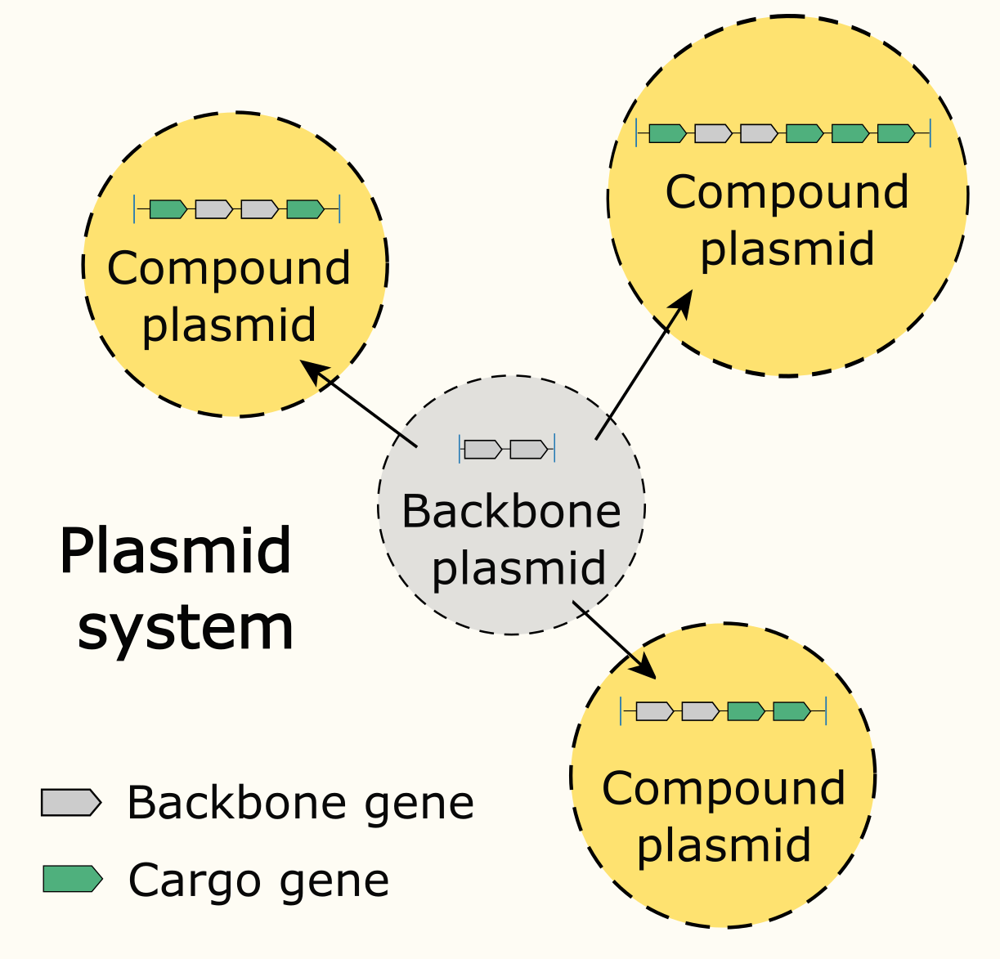
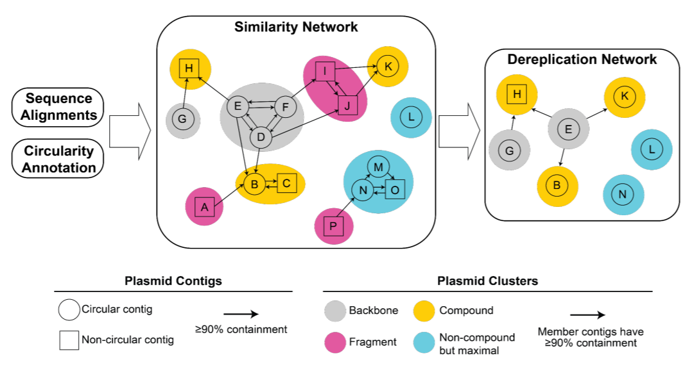
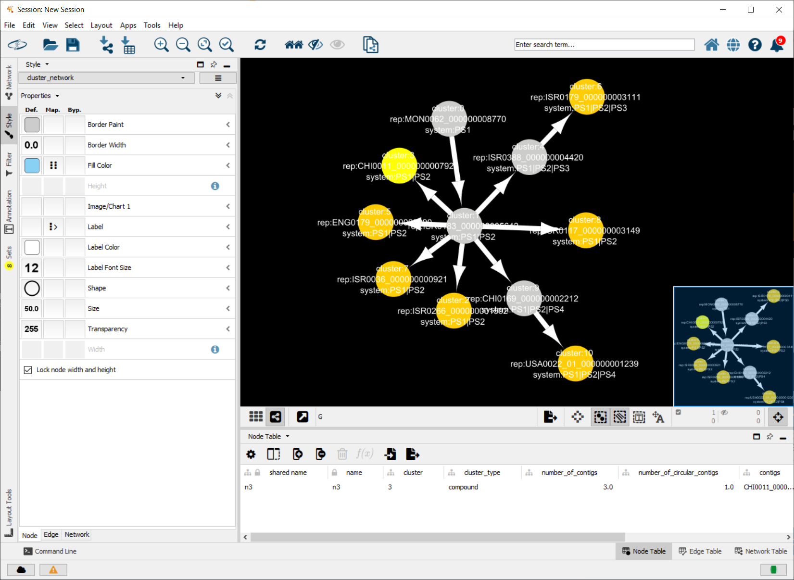
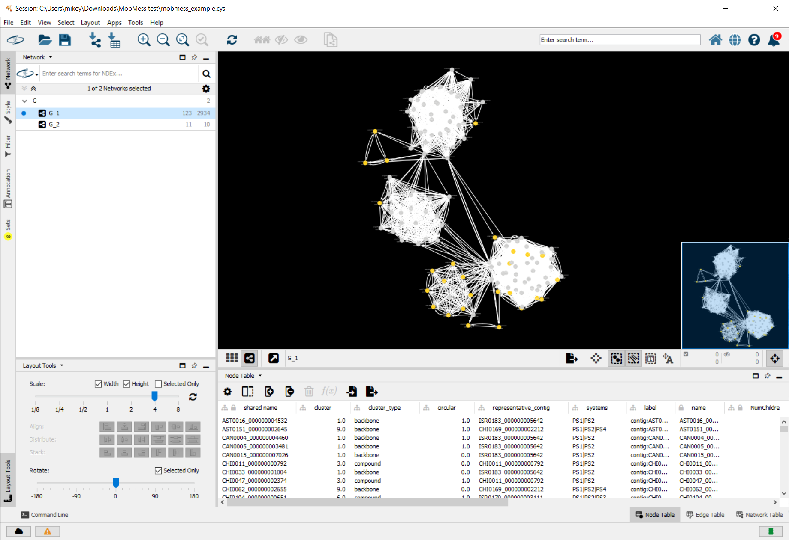
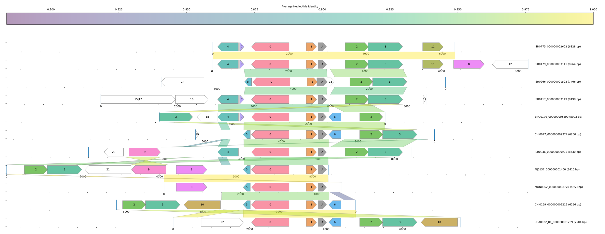

MobMess is a tool for **inferring** and **visualizing** evolutionary relations among plasmid sequences. MobMess performs the following functions:

1. **Infer** a non-redundant subset of plasmids from an input set of plasmid sequences. MobMess aligns every pair of sequences using [MUMmer4](https://mummer4.github.io/), and then clusters sequences that are highly similar along their entire lengths. MobMess then chooses one sequence to represent each cluster.

2. **Infer** "plasmid systems", which is an evolutionary phenomenon in which a "backbone plasmid" with core genes acquires accessory genes to form "compound plasmids". Here's a toy diagram of a plasmid system.

<p align="center">
  
</p>

3. **Visualize** a similarity network of many plasmids.

4. **Visualize** the shared gene and backbone content between a small set of plasmids.

This README includes tutorials for these functions. It also includes instructions for reproducing the 1,169 plasmid systems from our study ["The Genetic and Ecological Landscape of Plasmids in the Human Gut" by Michael Yu, Emily Fogarty, A. Murat Eren](https://www.biorxiv.org/content/10.1101/2020.11.01.361691v2).

# Installation

MobMess requires `python >=3.7`. We recommend installing MobMess in a new virtual environment using Anaconda, to make installing dependencies easier. **We have only tested MobMess on Linux machines. In the future, we will provide support for running on Mac OS and Windows.**

```
# Create virtual environment named "mobmess" (you can change the name to whatever you like)
conda create --name mobmess
# Install dependencies
conda install --name mobmess -y -c anaconda -c conda-forge -c bioconda --override-channels --strict-channel-priority  numpy pandas scipy scikit-learn igraph numba python-blosc mummer4
```

Alternatively, create the environment and install dependencies in a single command

```
conda create --name mobmess -y -c anaconda -c conda-forge -c bioconda --override-channels --strict-channel-priority  numpy pandas scipy scikit-learn igraph numba python-blosc mummer4
```

Then, activate the new environment
```
conda activate mobmess
```

Next, download and install [PlasX](https://github.com/michaelkyu/plasx), which has some utility functions that MobMess uses. You do not need to run the conda commands at https://github.com/michaelkyu/PlasX#installation, as the above conda commands already installs the relevant dependencies.
```
# Download the PlasX repository
# - If you've previously downloaded the repository, skip this command and
#   just change into the parent directory of where you downloaded it.
git clone https://github.com/michaelkyu/PlasX.git

# Install PlasX
pip install ./PlasX
```

Finally, download and install MobMess
```
git clone https://github.com/michaelkyu/MobMess.git
pip install ./MobMess
```

## Optional dependencies

For visualizing sequence alignments (see [tutorial](#tutorial-for-visualizing-the-sequence-alignment-and-shared-gene-content-of-plasmids)), you'll need to install the following extra packages

```
# Install optional dependencies
conda install -y seaborn
conda install -y -c conda-forge pypdf2 wkhtmltopdf
conda install -y jinja2
pip install pdfkit
```

# The MobMess algorithm

To learn more more about how MobMess works, please read the Supplementary Methods in our [biorxiv preprint (pages 31-33)](https://www.biorxiv.org/content/10.1101/2020.11.01.361691v2).

Here's a graphical example of the MobMess algorithm (Supplementary Figure S6A, p. 53, from preprint).

<p align="center">
  
</p>

# Tutorial for inferring plasmid systems using MobMess

In this tutorial, we will use MobMess to organize plasmids into plasmid systems. We will use an example set of plasmid sequences in `test/test-contigs.fa`, but you can repeat these steps with your own sequences. 

**Note that the output files of this tutorial are already in the `test` directory. Running the code in this tutorial will recreate the same files.**

**These are the contigs that are in plasmid system PS486, visualized in Figure 5D of our [biorxiv preprint](https://www.biorxiv.org/content/10.1101/2020.11.01.361691v2).**

### Preliminary setup of command line


```bash
# Change into the directory where MobMess was downloaded (e.g. where `git clone` downloaded to)
cd /path/to/MobMess

# Change into the `test` subdirectory that contains test-contigs.fa
cd test

# Input and output filename will start with this prefix
PREFIX='test-contigs'

# The number of CPU cores that will be used to align plasmids MUMmer. We recommend you setting it to a high number, to speed up the processing of many contigs
THREADS=4
```


### Understanding the format of the input files


We are going to run MobMess on this fasta file of 123 plasmid sequences


```bash
head test-contigs.fa
```

```
>MON0062_000000008770
TTGGTCACCCATAATATAAGGAACAATTCAATTTGTACGCTGTGCTTTAACATTTTGATACGATTTTAAGAGAATGAAATAAGTTTAAATCACTTCAATTTCAATTTTTGAATTATGTATTTCAGCAGACCTTGGACTTCTATCTAAGTGATAGGCAGTCCTGAAAATTCCAATCTCTTTTAGGTCAAGACAATTAGTCT

>AST0016_000000004532
AACAACAAGAAAACAAGTTTCTTTTCGTTTACGTGAGGATTTATTAATGGCTTTAAGGGAAGAAGCGAGAAAGGCTAACAAAAGCCTGAACGGTTTCGTAGAAAGCATTCTGGCAGATGCAATGCTGAAGAGAACCAATGAGGGTAATAACGTACTCATAAAAAACGATACAGAGGTTTAGTAAGGTTTTTTGGCATTTT

>CAN0004_000000004460
AACGACTTTAACAAATAAAAGTCGTAGATTGTGTAATTAGTATTCAAAAAGTCGTAGTTAAAGTTTGAAATAGTATTCAAAAAGTCGTAGTTAGTATTCAAAAAGTCGTAGTTAGATTCTTGTTGTTGCTTGTAATTTATTGTTTATCAGATTACTAAAACGTGTTTTTCGAAAGTCGATAAGCATATAACAAGTAATGC

>CAN0005_000000003481
CGGTAAGCCCTTCCAGCCGGGAGCTGGAGAAAATGGGCAAGACAGAGAAGGAACAGGCTGAAGCCATGAGAAGGTATGTCCGTGATGATGTGATGCAGCACTATGCGGAAGGGTTCGGAAAAGGCCTGAACAAAGAGGATATCGAGTATTACGGAAAGATCCATTTCGAGAGGAAGGGAGCCGACCGGTACGACATGCAC

>CAN0015_000000007026
TTTAGAGGATAAGGAACGACAGATGTTCCAGATAGTCCGGTTAATGGATGAACAACAATCTATTAACAAGAAGATAGCCAATCAAATTCCGGTTATTGTACAGAAAAGTGTGCAGGAACAGTCCAAAAAGCCAAAACGAAAAGGTTTCTTAGGCATATTCGGCAAAAAAAAGGAAGTAACTCCAGCAGTATCAACCACTA
```

MobMess also requires annotations of which sequences were assembled completely (as a circular DNA element), as opposed to being assembly fragments. MobMess uses this information to identify backbone plasmids, as it requires backbones to be complete.


```bash
# This is a two-column table, where the first column is the contig name and the second column indicates which sequences are complete.
# - The second column must contain the strings True/False or the integers 1/0, to represent complete/incomplete, respectively.
head test-contigs-circular.txt
```

```
MON0062_000000008770	1
AST0016_000000004532	1
CAN0004_000000004460	1
CAN0005_000000003481	1
CAN0015_000000007026	0
CHI0033_000000001004	0
CHI0132_000000005259	1
DEN0022_000000006299	0
DEN0056_000000000137	1
DEN0078_000000004762	1
```

### Infer plasmid systems

Activate the conda environment where MobMess is installed


```bash
conda deactivate
conda activate mobmess
```

MobMess can be run using the command line. 


```bash
# List the MobMess sub-commands. There are currently two sub-commands implemented: `systems` and `visualize`
mobmess -h
```

```
usage: mobmess [-h] {systems,visualize} ...

Runs MobMess algorithm to infer plasmid systems.

positional arguments:
  {systems,visualize}
    systems            Infer plasmid systems.
    visualize          Visualize the alignment of plasmids in a system. Useful
                       for seeing shared backbone content.

optional arguments:
  -h, --help           show this help message and exit
```                        

```bash
# See the options for `mobmess systems`
mobmess systems -h
```

```
usage: mobmess systems [-h] -s SEQUENCES -c COMPLETE -o OUTPUT [-a ANI] [-T THREADS] [--min-similarity MIN_SIMILARITY] [--min-coverage MIN_COVERAGE] [--tmp TMP]

optional arguments:
  -h, --help            show this help message and exit

required arguments:
  -s SEQUENCES, --sequences SEQUENCES
                        The sequences to align and cluster
  -c COMPLETE, --complete COMPLETE
                        Table indicating which sequences are assembled complete/circular
  -o OUTPUT, --output OUTPUT
                        Filename prefix for output files

optional arguments:
  -a ANI, --ani ANI     Precomputed file of MUMmer alignment results. Specifying this will skip computing MUMmer alignments, saving time.
  -T THREADS, --threads THREADS
                        Number of threads to do pairwise MUMmer alignments. Default: 1 thread
  --min-similarity MIN_SIMILARITY
                        Minimum alignment identity. Default: 0.9
  --min-coverage MIN_COVERAGE
                        Minimum alignment coverage. Default: 0.9
  --tmp TMP             Directory to save intermediate files, including ones created by nucmer. Default: a temporary directory that is deleted upon termination

```                        


```bash
# Infer plasmid systems (run `mobmess systems -h` to get help on parameters)
# -- (optional) You can specify a folder with the `--tmp` parameter to save intermediate files that are normally deleted after execution.
#    These files won't be of use for the normal user, but may be useful for debugging when filing a github issue.
mobmess systems \
    --sequences $PREFIX.fa \
    --complete $PREFIX-circular.txt \
    --output $PREFIX-mobmess \
    --threads $THREADS
```

### Understanding the output files

The above call to `mobmess systems` generates many files that start with `$PREFIX-mobmess` (i.e. `test-contigs-mobmess`). Here are some important notes to understand the files.

* Clusters are numbered using integers, i.e. 0, 1, 2, ...
* Clusters are categorized into four types: "backbone", "fragment", "compound", "maximal_not_in_system". 
  * These types are shown in the [graphical description of MobMess]([#the-mobmess-algorithm]). "maximal_not_in_system" refers to the blue nodes called "Non-compound but maximal"
* Every cluster has one contig that is designated as the representative.
* There is a one-to-one correspondence between plasmid systems and backbone clusters.
* Plasmid systems are named 'PS1' ... 'PSn' where n is the number of systems.
* Multiple values are concatenated with the '|' separator. 

Let's take a look at the format of each of the output files.

```bash
# Table that summarizes the pairwise sequence alignments generated by MUMMER.
# - The alignment is specified asymmetrically, such that one contig is the "reference" and the other contig is the "query"
# - C : the fraction of the query contig that is covered by alignment
# - I_local : the average nucleotide identity, calculated with respect to the aligned subregions
# - I_global : the average nucleotide identity, by considering the full length of the query. That is, subregions of the query sequence that weren't aligned are still factored into this calculation.
head $PREFIX-mobmess_ani.txt
```

```
reference	query	C	I_local	I_global
AST0016_000000004532	AST0016_000000004532	1.0	1.0	1.0
AST0016_000000004532	AST0151_000000002645	0.7538680138932744	0.9606282722513089	0.7241869276918219
AST0016_000000004532	CAN0004_000000004460	0.9805754077331867	0.9527191179218838	0.9342129375114532
AST0016_000000004532	CAN0005_000000003481	0.9805147058823529	0.952755905511811	0.9341911764705881
AST0016_000000004532	CAN0015_000000007026	0.8440320962888666	0.9544464250346604	0.8055834169174189
AST0016_000000004532	CHI0011_000000000792	0.688564110290794	0.9606126914660832	0.6614434232333886
AST0016_000000004532	CHI0033_000000001004	0.7208333333333333	0.9438496831986017	0.6803583133056588
AST0016_000000004532	CHI0047_000000002374	0.7312	0.9592997811816193	0.70144
AST0016_000000004532	CHI0062_000000002655	0.7285953177257525	0.9674087675005738	0.7048494983277592
```


```bash
# Table that summarizes plasmid contigs. Includes the assignment to clusters and systems.
head $PREFIX-mobmess_contigs.txt
```

```
contig	cluster	cluster_type	circular	representative_contig	systems
MON0062_000000008770	0	backbone	1	MON0062_000000008770	PS1
AST0016_000000004532	1	backbone	1	ISR0183_000000005642	PS1|PS2
CAN0004_000000004460	1	backbone	1	ISR0183_000000005642	PS1|PS2
CAN0005_000000003481	1	backbone	1	ISR0183_000000005642	PS1|PS2
CAN0015_000000007026	1	backbone	0	ISR0183_000000005642	PS1|PS2
CHI0033_000000001004	1	backbone	0	ISR0183_000000005642	PS1|PS2
CHI0132_000000005259	1	backbone	1	ISR0183_000000005642	PS1|PS2
DEN0022_000000006299	1	backbone	0	ISR0183_000000005642	PS1|PS2
DEN0056_000000000137	1	backbone	1	ISR0183_000000005642	PS1|PS2
```

```bash
# Table that summarizes plasmid clusters. Includes the assignment to systems.
head $PREFIX-mobmess_clusters.txt
```

```
cluster	cluster_type	circular	representative_contig	systems
MON0062_000000008770	0	backbone	1	MON0062_000000008770	PS1
AST0016_000000004532	1	backbone	1	ISR0183_000000005642	PS1|PS2
CAN0004_000000004460	1	backbone	1	ISR0183_000000005642	PS1|PS2
CAN0005_000000003481	1	backbone	1	ISR0183_000000005642	PS1|PS2
CAN0015_000000007026	1	backbone	0	ISR0183_000000005642	PS1|PS2
CHI0033_000000001004	1	backbone	0	ISR0183_000000005642	PS1|PS2
CHI0132_000000005259	1	backbone	1	ISR0183_000000005642	PS1|PS2
DEN0022_000000006299	1	backbone	0	ISR0183_000000005642	PS1|PS2
DEN0056_000000000137	1	backbone	1	ISR0183_000000005642	PS1|PS2
```

```bash
# Table that summarizes plasmid systems.
# - For conciseness, we're using `cut` to avoid printing columns 'backbone_cluster', 'backbone_plasmids', 'compound_clusters', and 'compound_plasmids'
cat $PREFIX-mobmess_systems.txt | cut -f1,2,3,6,7
```

```
system_name	backbone_cluster	number_of_backbone_plasmids	number_of_compound_clusters	number_of_compound_plasmids
PS1	0	1	10	122
PS2	1	146	9	49
PS3	4	6	1	9
PS4	9	60	1	1
```


```bash
# Two-column table of plasmid clusters that align to each other within the sequence similarity threshold (e.g. >=90% identity within aligned region, >=90% coverage of smaller cluster)
# - First column is the shorter cluster, and second column is the longer cluster.
# - Each row means that one or more contigs in the shorter cluster aligned to one or more contigs in the longer cluster, within the alignment similarity threshold.
head $PREFIX-mobmess_cluster_graph.txt
```

```
shorter_cluster	longer_cluster
0	0
0	1
1	1
1	2
1	3
1	4
1	5
1	6
1	7
```

# Tutorial for visualizing a plasmid similarity network in Cytoscape

`mobmess systems` produces *.graphml files that encode networks of plasmid similarities. We will visualize these networks using Cytoscape, which is a general application for analyzing and visualizing biological networks. Please install Cytoscape version >=3.8 from https://cytoscape.org/.

## Visualize the cluster-2-cluster similarity network

1. Open Cytoscape

2. Import a .graphml file. On the menu bar at the top, go to `>File >Import >Network from File...`. Then, select the file that describes the cluster-2-cluster network (in this tutorial, that's the file `test-contigs-mobmess_clusters.graphml`). 

3. Import a styles file. On the menu bar at the top, go to `>File >Import >Styles from File...`. Then, select the file `styles.xml`. This will import two styles, called "contig_network and "cluster_network", which specify visualization parameters like node colors, labels, etc.

4. Select the imported style. On the menu bar at the **left**, go to `>Style`, and then select the style called "cluster_network".
    [More tips on Cytoscape styles](https://manual.cytoscape.org/en/stable/Styles.html)
    
5. Use an algorithm to lay out the network nodes. We recommend using Prefuse Force Directed Layout. On the menu bar at the top, go to `>Layout >Prefuse Force Directed Layout >(none)`.
    [More tips on layout algorithms in Cytoscape](https://manual.cytoscape.org/en/stable/Navigation_and_Layout.html#prefuse-force-directed-layout)
    

You should now see something like this!


<p align="center">
  
</p>


## Visualize the contig-2-contig similarity network

You can repeat the above steps to visualize the network of contig-contig similarities. Just import `test-contigs-mobmess_contigs.graphml` (step 2) and select the style called "contig_network" (step 4). After you lay out the nodes (step 5), the nodes will be scrunched up very tightly together. One solution is to scale the view, by opening `>Layout >Layout Tools`, and then sliding the scale from 1 to around 4 ([more information on scaling](https://manual.cytoscape.org/en/stable/Navigation_and_Layout.html#scale)). Then, you should see something like this!


<p align="center">
  
</p>
    


## More notes on Cytoscape

If you can't see the directionality of edges (i.e. edges appear undirected), note that Cytoscape hides directionality when there are too many edges on the screen at the same time. To resolve this, go to the menu bar at the top, then go to `>Edit >Preferences >Properties...`. Then, set the parameter `render.edgeArrowThreshold` to something very high, e.g. 1000000. You should now be able to see directionality.

# Tutorial for visualizing the sequence alignment and shared gene content of plasmids

We will visualize the backbone and cargo content of plasmid system PS1, which we inferred in the above tutorial steps (e.g. see contents of `test-contigs-mobmess_systems.txt`). 

This system is the same as shown in Figure 5D (page 19) of our [biorxiv preprint](https://www.biorxiv.org/content/10.1101/2020.11.01.361691v2).

```bash
# See the options for `mobmess visualize`
mobmess visualize -h
```

```
usage: mobmess visualize [-h] -s SEQUENCES -a ANNOTATIONS [ANNOTATIONS ...] -o
                         OUTPUT [--contigs CONTIGS] [--align ALIGN]
                         [--neighborhood NEIGHBORHOOD]

optional arguments:
  -h, --help            show this help message and exit

required arguments:
  -s SEQUENCES, --sequences SEQUENCES
                        Fasta file of the sequences to align and cluster
  -a ANNOTATIONS [ANNOTATIONS ...], --annotations ANNOTATIONS [ANNOTATIONS ...]
                        Table of gene annotations to COGs, Pfams, and de novo
                        families
  -o OUTPUT, --output OUTPUT
                        PDF file to save visualization.

optional arguments:
  --contigs CONTIGS     A comma-separated list of contigs that you want to
                        visualize. E.g. 'contig1,contig2,contig3'. Default:
                        all contigs in the fasta file `--sequences` will be
                        visualized.
  --align ALIGN         Table of alignment blocks produced by MUMmer. If you
                        ran `mobmess systems` and saved intermediate fileswith
                        the `--tmp` flag, then use the file
                        'mummer_align.qr_filter.pkl.blp'.Default: if you don't
                        specify this file, then MUMmer alignments will be
                        computed on the fly.
  --neighborhood NEIGHBORHOOD
                        Only a neighborhood around each anchor gene will be
                        visualized. This specifies the size of the
                        neighborhood upstream and downstream of each anchor.
                        Default: Show 20kb. Setting this to zero "0" will
                        visualize the entire contigs.
```

First, we will specify which plasmid contigs that we want to visualize together. We'll pick 11 representative plasmids from system PS1.

```bash
# comma-separated list of contigs
contigs=CHI0047_000000002374,CHI0169_000000002212,ENG0179_000000005290,FIJ0137_000000001400,ISR0036_000000000921,ISR0117_000000003149,ISR0179_000000003111,ISR0266_000000001592,ISR0775_000000002602,MON0062_000000008770,USA0022_01_000000001239
```

Next, we'll need a table of gene annotations. 

* The table needs the columns 'contig', 'start', 'stop', 'direction', 'accession', 'source'
* (Optional) the table can have a column called 'description' (or equivalently, 'function') which describes the annotation.
* These tables can be generated using the [PlasX tutorial](https://github.com/michaelkyu/plasx#step-1-identify-genes-and-annotate-cogs-and-pfams-using-anvio) to annotate genes with COGs and Pfams (using anvi'o) and with de novo families (using MMseqs2)

```bash
# The table of gene annotations we'll use
head -20 $PREFIX-annotations.txt 
```

```
contig	start	stop	direction	accession	source	description
AST0016_000000004532	598	1201	f	mmseqs_5_318210	mmseqs	
AST0016_000000004532	1197	2097	f	mmseqs_5_318209	mmseqs	
AST0016_000000004532	2769	3312	r	mmseqs_5_318283	mmseqs	
AST0016_000000004532	3345	3459	f	mmseqs_5_318207	mmseqs	
AST0016_000000004532	3654	4635	r	COG20_5527	COG_2020_FUNCTION	Protein involved in initiation of plasmid replication (PDB:2Z9O)
AST0016_000000004532	3654	4635	r	COG5527	COG_2014_FUNCTION	Protein involved in initiation of plasmid replication
AST0016_000000004532	3654	4635	r	PF01051.21	Pfam_v32	Initiator Replication protein
AST0016_000000004532	3654	4635	r	mmseqs_25_318285	mmseqs	
AST0016_000000004532	5087	5354	f	mmseqs_5_46990681	mmseqs	
AST0016_000000004532	5394	5616	f	COG20_4115	COG_2020_FUNCTION	Toxin component of the Txe-Axe toxin-antitoxin module, Txe/YoeB family (PDB:2A6Q)
AST0016_000000004532	5394	5616	f	COG4115	COG_2014_FUNCTION	Toxin component of the Txe-Axe toxin-antitoxin module, Txe/YoeB family
AST0016_000000004532	5394	5616	f	K19158	KOfam	toxin YoeB [EC:3.1.-.-]
AST0016_000000004532	5394	5616	f	PF06769.14	Pfam_v32	YoeB-like toxin of bacterial type II toxin-antitoxin system
AST0016_000000004532	5394	5616	f	mmseqs_40_18476509	mmseqs	
AST0016_000000004532	5394	5616	f	mmseqs_5_21692046	mmseqs	
AST0151_000000002645	121	724	f	mmseqs_5_318210	mmseqs	
AST0151_000000002645	720	1620	f	mmseqs_5_318209	mmseqs	
AST0151_000000002645	1725	2679	r	COG20_2367	COG_2020_FUNCTION	Beta-lactamase class A (PenP) (PDB:6W34)
AST0151_000000002645	1725	2679	r	COG2367	COG_2014_FUNCTION	Beta-lactamase class A
```

```bash
# Visualize the alignment of plasmids in a system
# -- (Optional) You can generate the visualization slightly faster by using the alignment previously calculated by `mobmess systems` (from the above tutorial).
#    To do this, include the parameter `--align $PREFIX-mobmess_ani_blocks.txt`. If you don't specify this parameter, alignments will be computed on the fly.
mobmess visualize \
    --sequences $PREFIX.fa \
    --annotations $PREFIX-annotations.txt \
    --contigs $contigs \
    --output Figure-5D-genome-visualization.pdf 
```


Open the PDF file "Figure-5D-genome-visualization.pdf". You should see something like this. 


<p align="center">
  
</p>
    

Here's a quick explanation of what you're looking at.

1. Gene families that are found on multiple sequences are renumbered with the symbols A,B,...,1,2,3..., etc.
2. In general, "A" will represent a gene family found in almost all sequences. Other frequent gene families will be labeled as B, C,... etc. Genes assigned to letters will be colored gray.
3. The numbers 1,2,3,... are used to represent gene families found in only a few sequences. These are shaded different colors. If a gene family is found in only one sequence, then it is not colored (i.e. it has a white background).
4. The bottom of the PDF has a table that maps symbols to different gene families.
5. Sequences have been arranged by their similarity in gene content (Jaccard index). This is plotted in the histogram and heatmap at the top of the PDF.

# Reproduce plasmid systems from the study ["The Genetic and Ecological Landscape of Plasmids in the Human Gut" by Michael Yu, Emily Fogarty, A. Murat Eren](https://www.biorxiv.org/content/10.1101/2020.11.01.361691v2).
In this study, we predicted 226,194 plasmid contigs and then organized them into 1,169 plasmid systems. You can download a precomputed table that describes these plasmid systems.


```bash
# Download a precomputed table with information about plasmid systems in our study (~1 min on fast network)
wget https://zenodo.org/record/5819401/files/predicted_plasmids_systems.txt.gz
gunzip predicted_plasmids_systems.txt.gz

grep -v '#' predicted_plasmids_systems.txt | cut -f1-8 | head
```

```
system_name	backbone_cluster	number_of_backbone_plasmids	backbone_plasmids	compound_clusters	number_of_compound_clusters	number_of_compound_plasmids	compound_plasmids
PS1	1180	1	USA0047_01_000000006782	104257|104258|104259|104260|104261|104262|104263	7	26	AST0150_000000003279|AUS0014_000000004448|CHI0135_000000002208|CHI0150_000000001301|DEN0045_000000004247|ENG0024_000000002559|ENG0090_000000002209|ISR0003_000000003078|ISR0120_000000003329|ISR0222_000000004060|ISR0252_000000001013|ISR0259_000000001698|ISR0287_000000001305|ISR0343_000000001718|ISR0348_000000001086|ISR0376_000000002233|ISR0389_000000002379|ISR0802_000000001466|ISR0844_000000001897|ISR0852_000000000971|SPA0059_000000002718|SPA0107_000000003979|SPA0122_000000004474|USA0010_01_000000003640|USA0021_01_000000002558|USA0133_01_000000004011
PS2	1246	1	USA0044_01_000000001094	57453|62694|70008|71967|76572|122960|127080|127085	8	8	AST0019_000000000008|ENG0019_000000000010|ENG0060_000000000020|ENG0067_000000000023|ENG0174_000000000089|SPA0020_000000000102|SPA0027_000000000007|SPA0149_000000000166
PS3	1276	1	USA0041_01_000000014280	98822|105103|105106|105108	4	4	CHI0181_000000000733|DEN0089_000000000821|SPA0025_000000000866|SPA0146_000000000557
PS4	1425	1	USA0035_01_000000009056	113847	1	1	AST0059_000000003008
PS5	1660	1	USA0025_01_000000004006	127265|127280	2	5	AST0087_000000004237|CAN0006_000000006873|ISR0001_000000004559|ISR0201_000000004449|ISR0296_000000003088
PS6	1866	2	USA0018_01_000000008482|USA0039_01_000000008032	121213	1	2	USA0020_01_000000001444|USA0051_01_000000001114
PS7	2373	1	TAN0021_000000013580	21653|52208|69013	3	3	DEN0085_000000004815|ISR0812_000000018617|USA0031_01_000000004587
PS8	2793	1	TAN0007_000000033080	68390|68605	2	2	DEN0094_000000007794|ISR0810_000000006748
PS9	2940	1	TAN0005_000000004026	2941	1	1	TAN0007_000000005447
```

### Reproduce the table of plasmid systems

First, download a fasta file of the 226,194 predicted plasmid sequences


```bash
wget https://zenodo.org/record/5843600/files/predicted_plasmids.fa.gz
gunzip predicted_plasmids.fa.gz
```

Next, download information about their circularity (~1 min on fast network)


```bash
# Download a table that describe the plasmid sequences
wget https://zenodo.org/record/5819401/files/predicted_plasmids_summary.txt.gz
gunzip predicted_plasmids_summary.txt.gz
```


```bash
# Extract two columns from this table: the contig name and whether it is circular
grep -v '#' predicted_plasmids_summary.txt | cut -f1,18 | tail -n +2 > predicted_plasmids_circular.txt
```

```bash
head predicted_plasmids_circular.txt
```

```
MAD0004_000000000035	False
FIJ0168_000000000073	False
ISR0080_000000000116	False
SPA0003_000000000262	False
ISR0062_000000000346	True
MAD0056_000000000121	True
MAD0050_000000000091	False
AST0153_000000000532	False
ISR0063_000000000258	False
ENG0031_000000000248	False
```

Note that calculating pairwise alignments for this large set of plasmids will take a very long time (~10 days on 1 thread). You can shorten this time by increasing the number of threads.

Here, we will skip this intensive step by specifying a precomputed table of alignments using the `--ani` flag in `mobmess systems`.


```bash
# Download a precomputed table of alignment information (~5 min on fast network)
wget https://zenodo.org/record/5819401/files/predicted_plasmids_pairwise_alignments.txt.gz
gunzip predicted_plasmids_pairwise_alignments.txt.gz
```


```bash
# Infer plasmid systems (run `mobmess systems -h` to get help on parameters)
# (~2 min)
mobmess systems \
    --sequences predicted_plasmids.fa \
    --complete predicted_plasmids_circular.txt \
    --ani predicted_plasmids_pairwise_alignments.txt \
    --output predicted_plasmids_mobmess \
    --threads $THREADS
```


```bash
# Show table of plasmid systems
# - Compare this with the precomputed table, `predicted_plasmids_systems.txt`, that was downloaded above. They should be very similar.
# - Note that some of the numbering might differ slightly, due to randomness in how clusters and systems are numbered.
head predicted_plasmids_mobmess_systems.txt
```

```
system_name	backbone_cluster	number_of_backbone_plasmids	backbone_plasmids	compound_clusters	number_of_compound_clusters	number_of_compound_plasmids	compound_plasmids
PS1	1180	1	USA0047_01_000000006782	104243|104244|104245|104246|104247|104248|104249	7	26	AST0150_000000003279|AUS0014_000000004448|CHI0135_000000002208|CHI0150_000000001301|DEN0045_000000004247|ENG0024_000000002559|ENG0090_000000002209|ISR0003_000000003078|ISR0120_000000003329|ISR0222_000000004060|ISR0252_000000001013|ISR0259_000000001698|ISR0287_000000001305|ISR0343_000000001718|ISR0348_000000001086|ISR0376_000000002233|ISR0389_000000002379|ISR0802_000000001466|ISR0844_000000001897|ISR0852_000000000971|SPA0059_000000002718|SPA0107_000000003979|SPA0122_000000004474|USA0010_01_000000003640|USA0021_01_000000002558|USA0133_01_000000004011
PS2	1246	1	USA0044_01_000000001094	57444|62684|69998|71957|76558|122943|127062|127067	8	8	AST0019_000000000008|ENG0019_000000000010|ENG0060_000000000020|ENG0067_000000000023|ENG0174_000000000089|SPA0020_000000000102|SPA0027_000000000007|SPA0149_000000000166
PS3	1276	1	USA0041_01_000000014280	98807|105089|105092|105094	4	4	CHI0181_000000000733|DEN0089_000000000821|SPA0025_000000000866|SPA0146_000000000557
PS4	1425	1	USA0035_01_000000009056	113830	1	1	AST0059_000000003008
PS5	1660	1	USA0025_01_000000004006	127247|127262	2	5	AST0087_000000004237|CAN0006_000000006873|ISR0001_000000004559|ISR0201_000000004449|ISR0296_000000003088
PS6	1866	2	USA0018_01_000000008482|USA0039_01_000000008032	121195	1	2	USA0020_01_000000001444|USA0051_01_000000001114
PS7	2373	1	TAN0021_000000013580	21651|52204|69003	3	3	DEN0085_000000004815|ISR0812_000000018617|USA0031_01_000000004587
PS8	2793	1	TAN0007_000000033080	68380|68595	2	2	DEN0094_000000007794|ISR0810_000000006748
PS9	2940	1	TAN0005_000000004026	2941	1	1	TAN0007_000000005447
```
